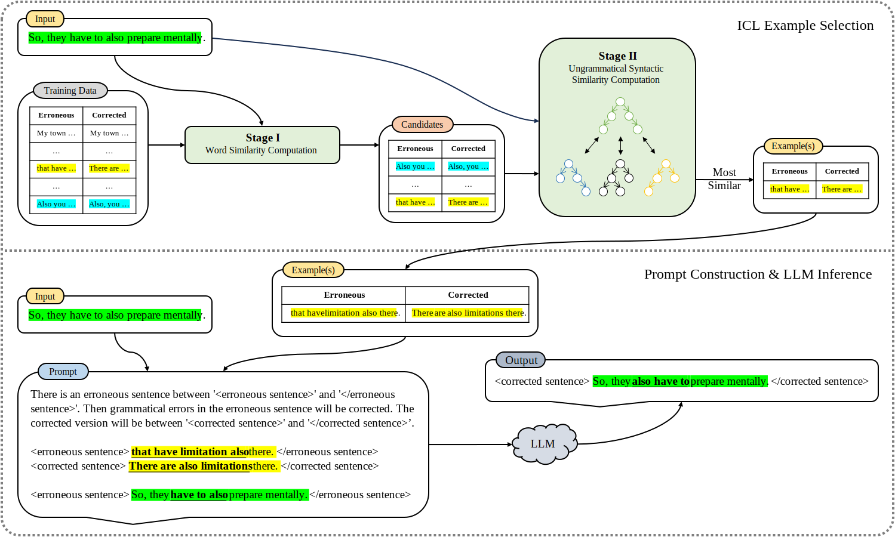

# SynICL4GEC: Ungrammatical-syntax-based In-context Example Selection for Grammatical Error Correction

[](https://aclanthology.org/2024.naacl-long.99/)
[](https://arxiv.org/abs/2403.19283)
[](LICENSE)

Source code for the paper **Ungrammatical-syntax-based In-context Example Selection for Grammatical Error Correction** (NAACL 2024).

## Getting Started
### 1. Prerequisites
#### 1.1 Environment
If you do not have G++ installed, you can install it by running:
```bash
sudo apt-get install g++
```

Then, install Python Environment:
```bash
pip install -r requirements.txt
```
#### 1.2 Models
- `bert-base-uncased` from [google-bert/bert-base-uncased](https://huggingface.co/google-bert/bert-base-uncased)
- `Llama-2-7b-chat-hf` from [meta-llama/Llama-2-7b-chat-hf](https://huggingface.co/meta-llama/Llama-2-7b-chat-hf)
- `Llama-2-13b-chat-hf` from [meta-llama/Llama-2-13b-chat-hf](https://huggingface.co/meta-llama/Llama-2-13b-chat-hf)
- If you want to run `gpt-3.5-turbo`, an OpenAI API key is required. Please refer to [OpenAI API](https://openai.com/blog/openai-api) for more information.
#### 1.3 Data Download
- `CoNLL-2014` can be downloaded [here](https://www.comp.nus.edu.sg/~nlp/conll14st/conll14st-test-data.tar.gz). We have already provided the processed data in `data/conll14/test.src`. If you want to evaluate on the test data, please use [m2scorer](https://www.comp.nus.edu.sg/~nlp/sw/m2scorer.tar.gz).
- `BEA-2019` can be downloaded [here](https://www.cl.cam.ac.uk/research/nl/bea2019st/data/ABCN.test.bea19.orig). We have already provided the processed data in `data/bea19/test.src`. If you want to evaluate on the test data, please submit your results to the [official website](https://codalab.lisn.upsaclay.fr/competitions/4057#participate).
- `W&I+LOCNESS` can be downloaded [here](https://www.cl.cam.ac.uk/research/nl/bea2019st/data/wi+locness_v2.1.bea19.tar.gz). We have already provided the processed data in `data/wi+locness/train.src` and `data/wi+locness/train.tgt`.
#### 1.4 Parsing
Please refer to [SynGEC](https://github.com/HillZhang1999/SynGEC) for parsing based on GEC-Oriented Parser (GOPar).

An example of parsing is shown below:
```bash
# in src/src_gopar of SynGEC
IN_FILE=../../../SynICL4GEC/data/conll14/test.src
OUT_FILE=../../../SynICL4GEC/data/conll14/test.gopar
python parse.py $IN_FILE $OUT_FILE ../../model/gopar/emnlp2022_syngec_biaffine-dep-electra-en-gopar
```

`data/conll14/test.src`, `data/bea19/test.src`, and `data/wi+locness/train.src` should be parsed to `data/conll14/test.gopar`, `data/bea19/test.gopar`, and `data/wi+locness/train.gopar`, respectively.

The `.gopar` file should be in the following format (taken from `data/conll14/test.gopar`):
```
1	Keeping	_	_	_	_	0	root	_	_
2	the	_	_	_	_	3	det	_	_
3	Secret	_	_	_	_	1	dobj	_	_
4	of	_	_	_	_	3	prep	_	_
5	Genetic	_	_	_	_	6	amod	_	_
6	Testing	_	_	_	_	4	pobj	_	_

1	What	_	_	_	_	0	root	_	_
2	is	_	_	_	_	1	cop	_	_
3	genetic	_	_	_	_	4	amod	_	_
4	risk	_	_	_	_	1	nsubj	_	_
5	?	_	_	_	_	1	punct	_	_
```

### 2. Running the Code
Run `src/run.bash` to select in-context examples (based on BM25, BERT, Tree Kernel, Polynomial Distance and two-stage methods) and call LLMs for GEC.

Note that *Tree Kernel* and *Polynomial Distance* are implemented in `src/tree_kernel.cc` and `src/polynomial.cc`, respectively.

## Our Proposed Method


- **Stage I** (Optional): Select candidates with similar words or semantics based on BM25 or BERT.
- **Stage II**: Select in-context examples with similar (ungrammatical) syntax based on *Tree Kernel* or *Polynomial Distance* from the candidates selected in Stage I.

(15/04/2024 Update) Our reimplemented Polynomial algorithm is a little different from Liu et al. (2022) when converting trees to polynomials. The terms of each child polynomial are all multiplied together instead of being summed up before being multiplied by other polynomials. This makes the complexity of the algorithm nearly linear.

## Experimental Results


## Acknowledgements
This work is supported by the National Natural Science Foundation of China (62076008) and the Key Project of Natural Science Foundation of China (61936012).

## Citation
If you find this repository useful, please cite our paper:
```bibtex
@misc{tang2024ungrammaticalsyntaxbased,
      title={Ungrammatical-syntax-based In-context Example Selection for Grammatical Error Correction}, 
      author={Chenming Tang and Fanyi Qu and Yunfang Wu},
      year={2024},
      eprint={2403.19283},
      archivePrefix={arXiv},
      primaryClass={cs.CL}
}

```

